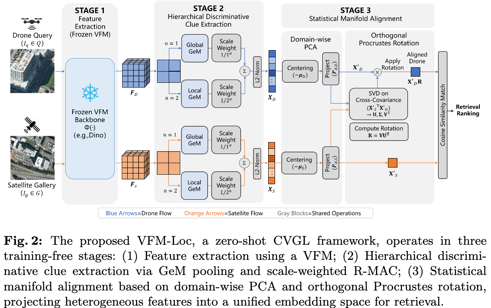
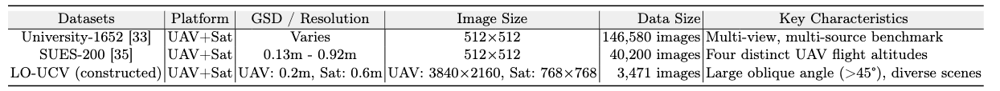
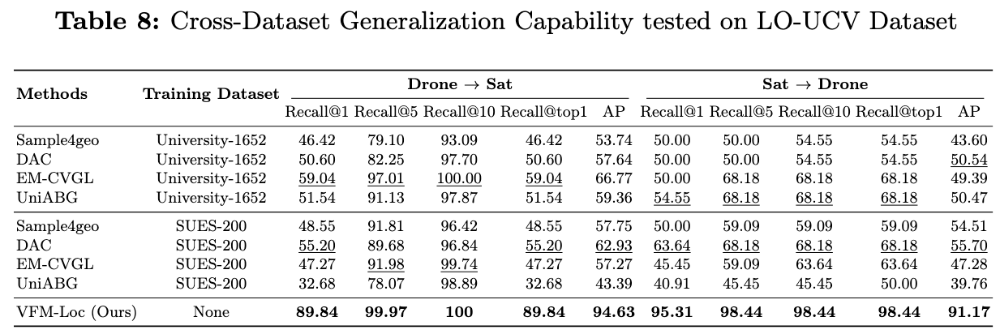

## Summary

- 研究任务：drone-satellite cross-view localization
- 研究问题：即使Supervised Methods在Closed数据集上取得更好的结果，但是在实际开放场景中还是受限于view differences and dataset bias
- 研究方案：
  - 提出一个 training-free 的 zero-shot CVGL (cross-view geo-localization) framework，利用 VFM 的强泛化特征和自己设计的 feature aggregation module 输出 view-alignment global descriptor for retrieval.
  - 提出一个具有 large oblique angles 大斜角的研究任务数据集 LO-UCV
- 实现效果：在University-1652上比经典的supervised方法好，但是还是没比过最近的研究；在老数据集 SUE-200反而是所比方法的SOTA

## Key Ideas

### Pipeline

#### Hierarchical discriminative clue extraction

这部分用于总结局部特征中有判别力的信息，组织成global descriptor

#### Statistical manifold alignment and orthogonal Procrustes rotation

这部分利用PCA分析得到domain-specific特征空间的正交矩阵，直觉上说将domain-specific manifold分解为domain-agnostic semantic subspace和domain-noise subspace，然后把特征通过PCA分析得到的特征矩阵将global descriptor投影到domain-agnostic subspace. 感觉是参考了连续学习中的`正交特性`子方向。

### Datasets

由于不做训练，本文构建数据集数量还是挺少的，但是无人机倾角大。

在个人数据集上还是非常SOTA的。
